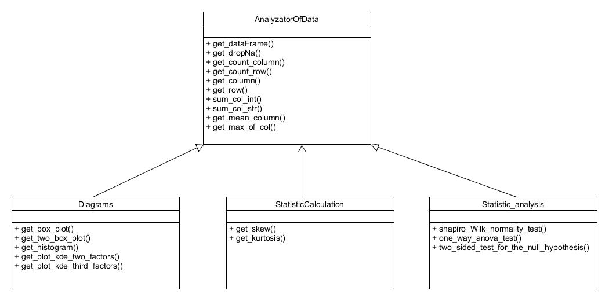

## General info
The project aims to do a basic data analysis based on the data loaded in Python. 
The project included data on selected biochemical and clinical parameters collected for patients with ischemic heart disease.
In the future I want to improve the project so that it reads other files than in xlsx format and performs more basic 
and complex statistical methods
	
## Technologies
Project is created with:
* PYTHON
## Used libraries
*pandas
*functools
*scipy.stats

## UML diagram
